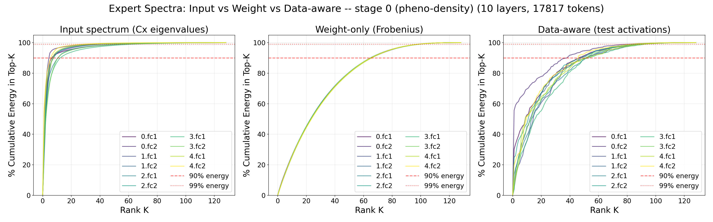
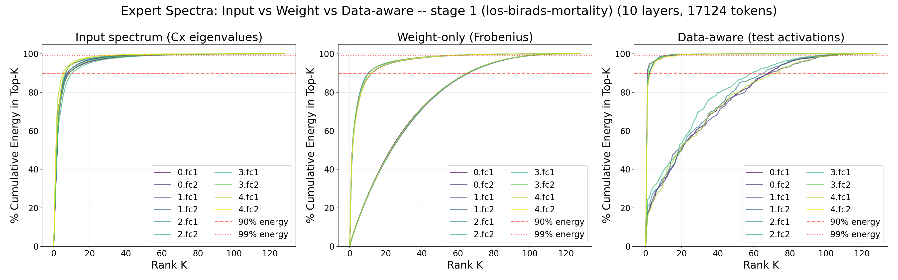
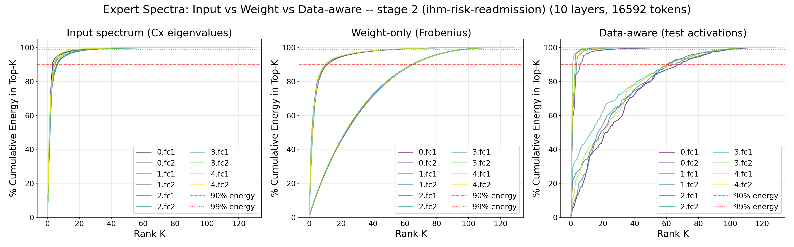

# FLAME: Adaptive Mixture-of-Experts for Continual Multimodal Multi-Task Learning

## Instructions to Run:
Under your virtual environment, run
```
pip install -r requirements.txt
```
To train the models, go to dir `clinical-highmmt/src/` and run
```
./run.sh
```
The results will be saved under `clinical-highmmt/src/results/`.

To analyze the weights, go to `clinical-highmmt` and run 
```
./src/analysis/run_analysis.sh
```
Results will be saved under `clinical-highmmt/src/analysis/results/`.

## Expert Spectral Analysis

Cumulative spectral energy captured by the top-K components of each expert, measured at
three points in the continual-learning curriculum. Every figure compares three views over
10 layers and 5 experts (`fc1`/`fc2` per expert): the **input spectrum** (eigenvalues of the
input covariance `Cx`), the **weight-only** spectrum (Frobenius-normalized singular values
of the expert weights), and the **data-aware** spectrum (singular values of the test-time
activations). Dashed and dotted lines mark the 90% and 99% energy thresholds.

### Stage 0 — `pheno-density` (17,817 tokens)



### Stage 1 — `los-birads-mortality` (17,124 tokens)



### Stage 2 — `ihm-risk-readmission` (16,592 tokens)


